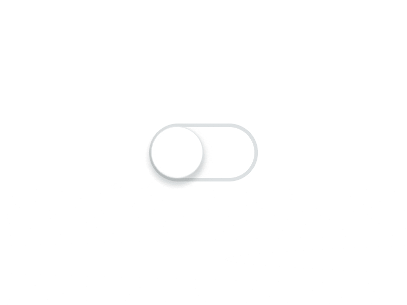
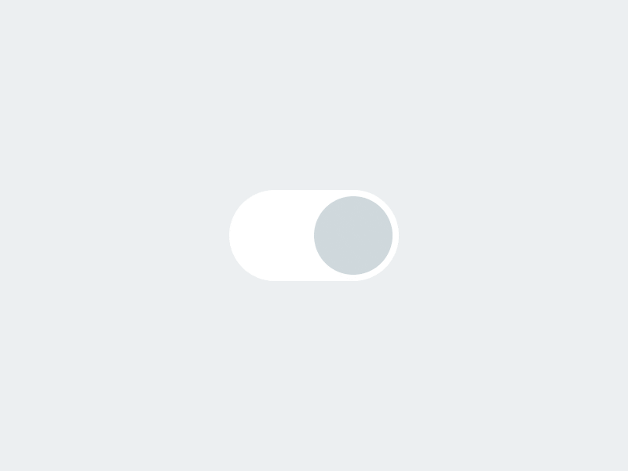
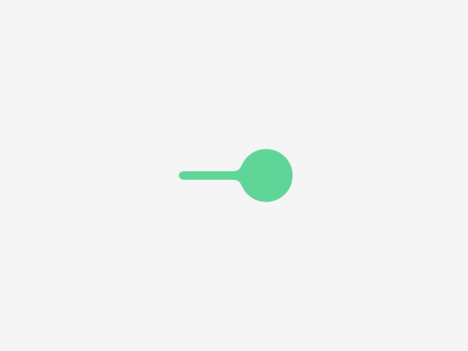

# TKSwitcherCollection

> 一组带动画效果的 Switch 开关, 支持 UIKit 和 SwiftUI。

[English](README.md) | 简体中文


[](LICENSE)

| Switch                    | 示例                                                         |
|---------------------------|--------------------------------------------------------------|
| `TKSimpleSwitch`          |    |
| `TKSimpleSwitch` (rotate) |   |
| `TKExchangeSwitch`        |  |
| `TKSmileSwitch`           |     |
| `TKLiquidSwitch`          |    |

Switch 设计来自 [Oleg Frolov](https://dribbble.com/OlegFrolov)。

## Features

- 四种动画开关: simple (可选旋转特效), exchange, smile, liquid。
- UIKit 控件基于 `UIControl`: 支持 target/action 和 `@IBDesignable` / `@IBInspectable`。
- SwiftUI 包装使用 `Binding<Bool>`, 与 UIKit 版本共享相同动画。
- 配合语义化颜色自动适配 Light / Dark Mode。

## Requirements

- iOS 13.0+
- Swift 6 工具链 (Xcode 16+)

## Installation

### Swift Package Manager

在 Xcode 中选择 **File > Add Package Dependencies...**, 输入仓库地址:

```
https://github.com/TBXark/TKSwitcherCollection
```

或者添加到 `Package.swift`:

```swift
dependencies: [
    .package(url: "https://github.com/TBXark/TKSwitcherCollection.git", from: "2.0.0")
]
```

### CocoaPods

```ruby
pod 'TKSwitcherCollection', '~> 2.0'
```

## Usage

### UIKit

所有开关都是 `UIControl` 子类, 点击切换状态并发送 `.valueChanged` 事件。

```swift
import UIKit
import TKSwitcherCollection

let switcher = TKSimpleSwitch(frame: CGRect(x: 0, y: 0, width: 100, height: 50))
switcher.onColor = .systemGreen
switcher.rotateWhenValueChange = true

// 闭包回调: 用户点击开关时触发, 参数为切换后的新状态
switcher.onValueChange = { value in
    print("switch -> \(value)")
}

// 或者使用 target/action
switcher.addTarget(self, action: #selector(handleValueChanged(_:)), for: .valueChanged)

// 编程式修改不会触发事件 (与 UISwitch.setOn(_:animated:) 一致)
switcher.isOn = false            // 立即更新, 无动画
switcher.setOn(true)             // 带动画
```

可用的开关: `TKSimpleSwitch`, `TKExchangeSwitch`, `TKSmileSwitch`, `TKLiquidSwitch`。

### SwiftUI

每个开关都提供 SwiftUI 视图, 内部封装 UIKit 实现以保证动画一致。`isOn` 是普通的 `Binding<Bool>`。

```swift
import SwiftUI
import TKSwitcherCollection

struct DemoView: View {
    @State private var isOn = true

    var body: some View {
        TKSimpleSwitchView(isOn: $isOn, rotateWhenValueChange: true)
            .frame(width: 100, height: 50)
    }
}
```

可用的视图: `TKSimpleSwitchView`, `TKExchangeSwitchView`, `TKSmileSwitchView`, `TKLiquidSwitchView`。

## Customization

UIKit 控件和 SwiftUI 视图都支持以下属性配置:

| Switch             | 属性                                                                                 |
|--------------------|--------------------------------------------------------------------------------------|
| `TKSimpleSwitch`   | `onColor`, `offColor`, `lineColor`, `circleColor`, `lineSize`, `rotateWhenValueChange` |
| `TKExchangeSwitch` | `lineColor`, `onColor`, `offColor`, `lineSize`                                        |
| `TKSmileSwitch`    | –                                                                                    |
| `TKLiquidSwitch`   | `onColor`, `offColor`                                                                |

所有开关都暴露 `isOn`, `animationDuration`, `onValueChange` 和 `setOn(_:animated:)`。

## Demo

```bash
make demo
```

Demo 工程由 [XcodeGen](https://github.com/yonaskolb/XcodeGen) 根据 `Demo/project.yml` 生成, 在 UIKit 和 SwiftUI 两个 Tab 中展示所有开关。`make demo-build` 可在命令行构建。

## License

**TKSwitcherCollection** 使用 MIT 协议, 详见 [LICENSE](LICENSE)。

TBXark – [@tbxark](https://twitter.com/tbxark) – tbxark@outlook.com
